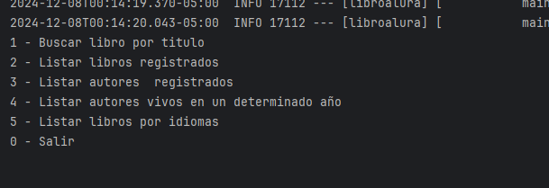
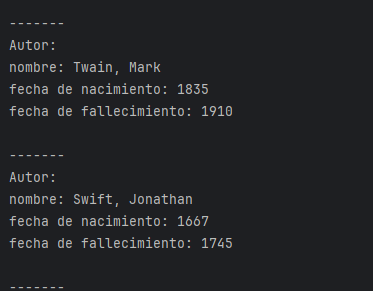

# LiterAlura 🌎

Este es un proyecto de solicitudes a una API de libros, manipulación datos JSON, guardado en una base de datos,  utilizando la API de [Gutendex-API](https://gutendex.com/). El programa permite buscar.


## Características

- Buscar libro por titulo 
- Listar libros registrados
- Listar autores  registrados
- Listar autores vivos en un determinado año
- Listar libros por idiomas
- Menú interactivo para seleccionar opciones.


  
## Instalación

1. Clona el repositorio en tu máquina local:

```bash
git clone https://github.com/V1kt0or/Literalura.git
```

2. Instala las dependencias necesarias.


### Ejemplo de ejecución

```bash
********************************
"""
                    1 - Buscar libro por titulo 
                    2 - Listar libros registrados
                    3 - Listar autores  registrados
                    4 - Listar autores vivos en un determinado año
                    5 - Listar libros por idiomas
                    0 - Salir
                    """
********************************
```

  
## Contribuciones

¡Las contribuciones son bienvenidas! Si tienes mejoras o deseas corregir errores, simplemente abre un `pull request` o crea una `issue` para discutir los cambios.
